# Project Hermes -- Architecture Diagrams

A comprehensive visual reference for the Hermes multi-tenant, multi-channel message broker platform built in Go.

---

## 1. System Overview (C4 Context)

High-level view of external actors, the Hermes platform boundary, and the third-party systems it integrates with. Enterprise tenants interact with a single API surface; Hermes handles authentication, routing, delivery, and observability behind the scenes.

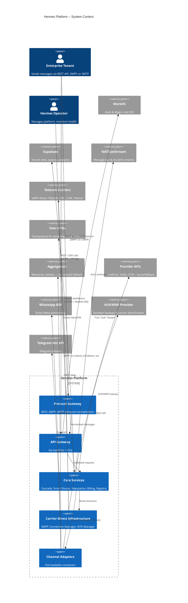

---

## 2. Main Cluster Architecture (Component Diagram)

Internal services that make up the Hermes main cluster. All inter-service communication flows through NATS JetStream for decoupling and durability. The Protocol Gateway and API Gateway are the externally exposed surfaces, accepting SMPP, SMTP, and REST traffic. The Smart Router and carrier-direct infrastructure enable lowest-cost delivery paths.

```mermaid
flowchart TB
    subgraph external["External"]
        client_rest(["Tenant Client (REST)"])
        client_smpp(["Enterprise Client (SMPP)"])
        client_smtp(["Enterprise Client (SMTP)"])
        carriers(["Telecom Carriers<br/><i>Telia DK, TDC, 3 DK, Telenor</i>"])
        aggregators(["Aggregators<br/><i>Messente, Infobip</i>"])
        providers(["Provider APIs<br/><i>SendGrid, Twilio, FCM</i>"])
        webhooks(["Provider Webhooks / DLRs"])
    end

    subgraph main_cluster["Main Cluster"]
        direction TB

        subgraph gateway_layer["Ingress"]
            pgw["Protocol Gateway<br/><i>SMPP Server (gosmpp)<br/>SMTP Server (go-smtp)</i><br/>Protocol normalization"]
            gw["API Gateway<br/><i>Go: net/http + Chi router</i><br/>TLS termination, routing,<br/>9-layer validation pipeline"]
        end

        subgraph core_services["Core Services"]
            tr["Tenant Registry<br/><i>Onboarding, WorkOS magic-link,<br/>heartbeat, tier management</i>"]
            car["Channel Adapter Registry<br/><i>Hot-loadable containers,<br/>Ed25519 auth, allowlist</i>"]
            ce["Cascade Engine<br/><i>State machine, multi-channel<br/>fallback orchestration</i><br/><b>Core IP</b>"]
            sr["Smart Router<br/><i>HLR/MNP lookup, least-cost<br/>routing, carrier selection,<br/>direct vs aggregator decision</i>"]
            re["Reputation Engine<br/><i>IP pools, warming,<br/>blacklist monitor,<br/>tenant health scoring</i>"]
        end

        subgraph carrier_services["Carrier-Direct Infrastructure"]
            smpp_mgr["SMPP Connection Manager<br/><i>Connection pools, bind mgmt,<br/>window flow control, DLR handling</i>"]
            mta_mgr["MTA Manager<br/><i>MTA pool orchestration,<br/>IP warming, DKIM/SPF/DMARC,<br/>ISP feedback loops</i>"]
        end

        subgraph support_services["Support Services"]
            bm["Billing & Metering<br/><i>Usage tracking, quota<br/>enforcement, invoicing</i>"]
            tp["Tenant Provisioner<br/><i>Supabase schema creation,<br/>namespace setup, key gen</i>"]
            obs["Observability Stack<br/><i>OpenTelemetry traces,<br/>Prometheus metrics,<br/>structured logging</i>"]
        end
    end

    subgraph messaging["Message Bus"]
        nats[("NATS JetStream<br/>Durable streams,<br/>consumer groups")]
    end

    subgraph data["Data Layer"]
        supa[("Supabase<br/>Tenant data,<br/>message logs")]
    end

    subgraph auth_layer["Auth"]
        workos["WorkOS<br/>Magic Link SSO"]
    end

    client_rest -->|"HTTPS + API Key"| gw
    client_smpp -->|"SMPP 3.4 bind"| pgw
    client_smtp -->|"SMTP session"| pgw
    pgw -->|"Normalized messages"| gw
    webhooks -->|"Delivery callbacks / DLRs"| gw

    gw <-->|"Auth check"| workos
    gw -->|"Validated request"| nats

    nats <--> ce
    nats <--> tr
    nats <--> car
    nats <--> sr
    nats <--> re
    nats <--> bm
    nats <--> tp
    nats <--> obs
    nats <--> smpp_mgr
    nats <--> mta_mgr

    ce -->|"Route decision"| sr
    sr -->|"DIRECT: carrier"| smpp_mgr
    sr -->|"DIRECT: own MTA"| mta_mgr
    sr -->|"AGGREGATOR / FALLBACK"| car
    car -->|"Dispatch"| aggregators
    car -->|"Dispatch"| providers
    smpp_mgr -->|"SMPP submit_sm"| carriers
    carriers -->|"deliver_sm (DLR)"| smpp_mgr
    smpp_mgr -->|"Forward DLR"| pgw

    ce <-->|"Score query"| re
    ce <-->|"Balance check"| bm
    tr <-->|"Provision"| tp

    tr <--> supa
    ce <--> supa
    bm <--> supa
    tp <--> supa
    re <--> supa
    sr <--> supa

    style ce fill:#2d6a4f,stroke:#1b4332,color:#fff
    style sr fill:#e76f51,stroke:#9b2226,color:#fff
    style pgw fill:#264653,stroke:#2a9d8f,color:#fff
    style gw fill:#1d3557,stroke:#0d1b2a,color:#fff
    style smpp_mgr fill:#6a040f,stroke:#e5383b,color:#fff
    style mta_mgr fill:#6a040f,stroke:#e5383b,color:#fff
    style nats fill:#6a040f,stroke:#370617,color:#fff
    style supa fill:#3a0ca3,stroke:#240046,color:#fff
```

---

## 3. Tenant Tier Model

Hermes supports three tenant tiers, each with progressively more isolation. The tier determines the Supabase topology, worker allocation, IP pool strategy, and whether custom adapters are allowed.

```mermaid
flowchart LR
    subgraph starter_tier["Starter Tier"]
        direction TB
        s_desc["Shared infrastructure<br/>Low cost, fast onboarding"]
        s_supa[("Shared Supabase Project<br/><i>schema-per-tenant isolation</i>")]
        s_workers["Shared Worker Pool"]
        s_ip["Shared IP Pool"]
        s_limits["Rate limits: standard<br/>Channels: email, SMS<br/>Support: community"]
    end

    subgraph business_tier["Business Tier"]
        direction TB
        b_desc["Dedicated data layer<br/>Higher throughput"]
        b_supa[("Dedicated Supabase Project<br/><i>full database isolation</i>")]
        b_workers["Dedicated Worker Pool"]
        b_ip["Dedicated IP Addresses"]
        b_limits["Rate limits: elevated<br/>Channels: all standard<br/>Support: priority"]
    end

    subgraph enterprise_tier["Enterprise Tier"]
        direction TB
        e_desc["Full isolation<br/>Custom everything"]
        e_supa[("On-Premise Supabase<br/><i>self-hosted or VPC</i>")]
        e_workers["Dedicated Cluster"]
        e_ip["BYOIP<br/>Bring Your Own IPs"]
        e_adapters["Custom Adapters<br/><i>tenant-provided channels</i>"]
        e_limits["Rate limits: custom<br/>Channels: all + custom<br/>Support: dedicated SLA"]
    end

    starter_tier ---|"Upgrade"| business_tier
    business_tier ---|"Upgrade"| enterprise_tier

    style starter_tier fill:#f0f4f8,stroke:#9db5c9,color:#1a1a2e
    style business_tier fill:#e8f5e9,stroke:#66bb6a,color:#1a1a2e
    style enterprise_tier fill:#fff3e0,stroke:#ffa726,color:#1a1a2e
```

---

## 4. Message Flow (Sequence Diagram)

End-to-end lifecycle of a single message: from tenant API call through the 9-layer validation pipeline, into the Cascade Engine for multi-channel orchestration, out through an adapter to a provider, and back via webhook for confirmation or fallback.

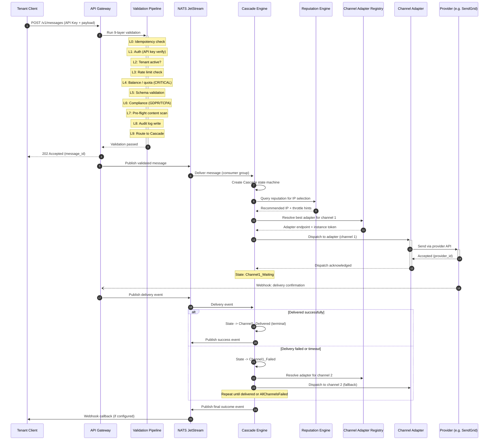

---

## 5. Cascade Engine State Machine

The Cascade Engine is the core intellectual property of Hermes. It manages a per-message state machine that orchestrates delivery across multiple channels with automatic fallback. Each channel attempt has a configurable timeout before escalation.

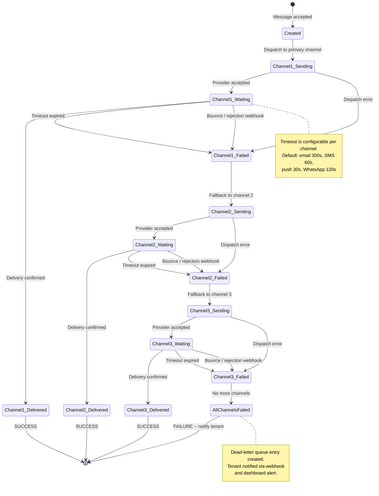

---

## 6. Tenant Onboarding Flow

The complete provisioning sequence when a new tenant signs up. Authentication is handled by WorkOS magic links (passwordless). Once verified, the Tenant Provisioner creates the appropriate Supabase resources based on the selected tier.

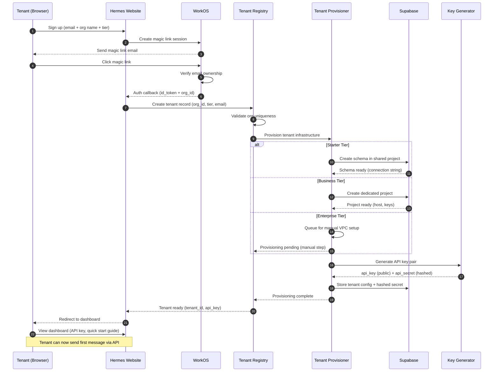

---

## 7. Channel Adapter Registration

Channel adapters are hot-loadable containers that implement the Hermes adapter protocol. They register via Ed25519 signature verification and maintain liveness through heartbeats. The registry can signal graceful shutdown via the heartbeat response.

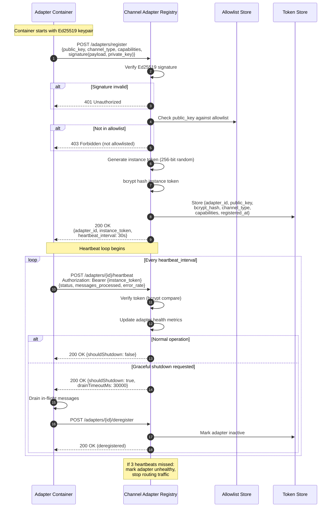

---

## 8. IP Reputation Engine

The Reputation Engine manages IP health across the platform. It combines warming schedules, blacklist monitoring, ISP feedback loops, and per-tenant health scores to make real-time routing decisions about which IP to use for each message.

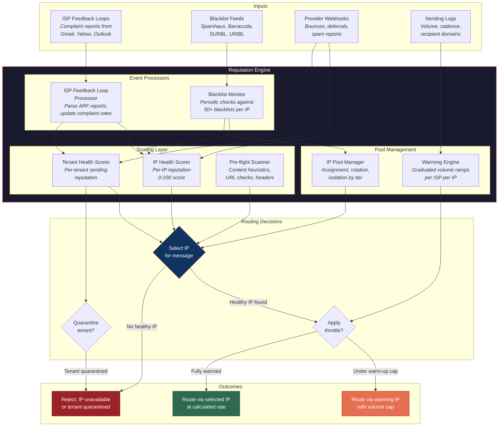

---

## 9. Nine-Layer Validation Pipeline

Every inbound API request passes through a strict 9-layer pipeline before reaching the Cascade Engine. Each layer can reject the request with a specific error code. The pipeline is designed to fail fast: cheap checks run first, expensive checks run last.

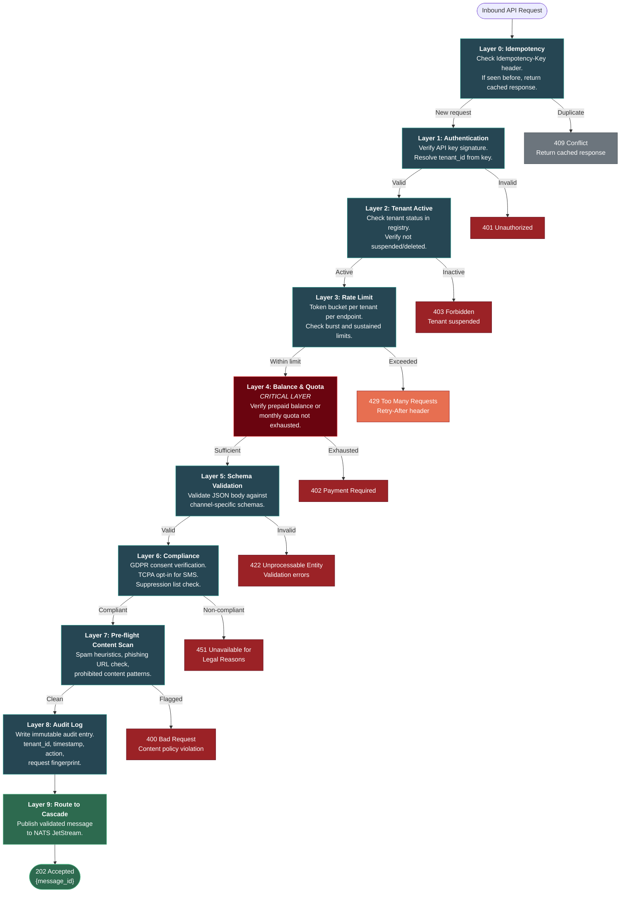

---

## 10. Deployment Architecture

Hermes runs as Docker Compose in development and Kubernetes in production. The production layout uses a dedicated namespace for platform services, per-tenant namespaces for Enterprise-tier isolation, and auto-scaled adapter pods.

### Development (Docker Compose)

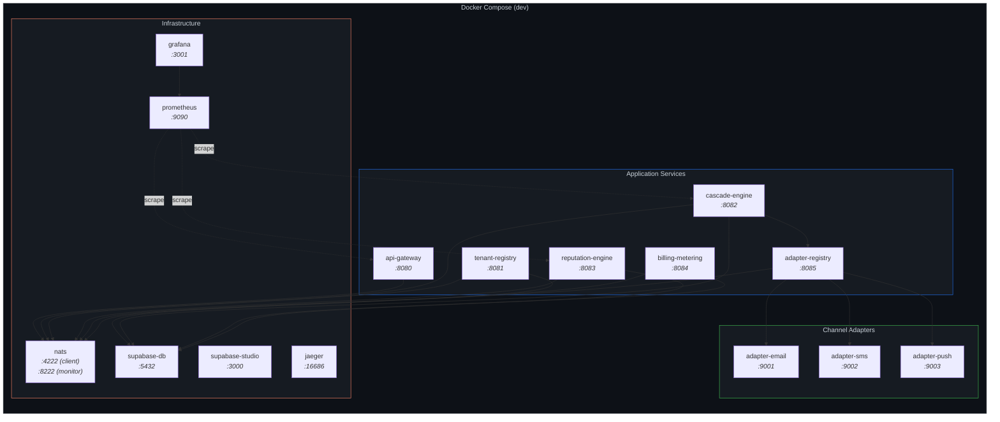

### Production (Kubernetes)

```mermaid
flowchart TB
    subgraph k8s_cluster["Kubernetes Cluster"]
        direction TB

        subgraph ingress_ns["Namespace: ingress"]
            lb["Cloud Load Balancer"]
            ing["Ingress Controller<br/><i>nginx / envoy</i>"]
        end

        subgraph hermes_ns["Namespace: hermes-platform"]
            direction TB
            gw_k8s["api-gateway<br/><i>Deployment (3 replicas)</i>"]
            tr_k8s["tenant-registry<br/><i>Deployment (2 replicas)</i>"]
            ce_k8s["cascade-engine<br/><i>Deployment (5 replicas)</i><br/><i>HPA: CPU + queue depth</i>"]
            re_k8s["reputation-engine<br/><i>Deployment (2 replicas)</i>"]
            bm_k8s["billing-metering<br/><i>Deployment (2 replicas)</i>"]
            car_k8s["adapter-registry<br/><i>Deployment (2 replicas)</i>"]
            tp_k8s["tenant-provisioner<br/><i>Deployment (1 replica)</i>"]
        end

        subgraph adapters_ns["Namespace: hermes-adapters"]
            email_k8s["adapter-email<br/><i>Deployment (HPA 3-20)</i>"]
            sms_k8s["adapter-sms<br/><i>Deployment (HPA 2-10)</i>"]
            whatsapp_k8s["adapter-whatsapp<br/><i>Deployment (HPA 2-10)</i>"]
            telegram_k8s["adapter-telegram<br/><i>Deployment (HPA 1-5)</i>"]
            push_k8s["adapter-push<br/><i>Deployment (HPA 2-10)</i>"]
        end

        subgraph nats_ns["Namespace: nats"]
            nats_k8s["NATS JetStream Cluster<br/><i>StatefulSet (3 replicas)</i><br/><i>PVC: 100Gi per node</i>"]
        end

        subgraph obs_ns["Namespace: observability"]
            otel["OTel Collector<br/><i>DaemonSet</i>"]
            prom_k8s["Prometheus<br/><i>StatefulSet</i>"]
            grafana_k8s["Grafana"]
            tempo["Tempo<br/><i>Distributed traces</i>"]
            loki["Loki<br/><i>Log aggregation</i>"]
        end

        subgraph ent_ns["Namespace: tenant-{id} (Enterprise)"]
            ent_workers["Dedicated Workers<br/><i>Isolated pod pool</i>"]
            ent_adapters["Custom Adapters<br/><i>Tenant-provided images</i>"]
            ent_supa["Supabase Proxy<br/><i>-> On-premise instance</i>"]
        end
    end

    subgraph external_k8s["External Services"]
        supa_shared["Supabase Cloud<br/><i>Starter + Business tiers</i>"]
        supa_ent["On-Premise Supabase<br/><i>Enterprise tier</i>"]
        workos_k8s["WorkOS"]
    end

    lb --> ing
    ing --> gw_k8s
    gw_k8s --> nats_k8s
    ce_k8s --> nats_k8s
    tr_k8s --> nats_k8s
    re_k8s --> nats_k8s
    bm_k8s --> nats_k8s
    car_k8s --> nats_k8s

    car_k8s --> email_k8s
    car_k8s --> sms_k8s
    car_k8s --> whatsapp_k8s
    car_k8s --> telegram_k8s
    car_k8s --> push_k8s
    car_k8s -.->|"Enterprise"| ent_adapters

    tr_k8s --> supa_shared
    ce_k8s --> supa_shared
    bm_k8s --> supa_shared
    ent_workers --> ent_supa
    ent_supa --> supa_ent
    gw_k8s --> workos_k8s

    otel -.->|"collect"| hermes_ns
    otel -.->|"collect"| adapters_ns
    otel --> tempo
    otel --> loki
    prom_k8s -.->|"scrape"| hermes_ns
    prom_k8s -.->|"scrape"| adapters_ns
    grafana_k8s --> prom_k8s
    grafana_k8s --> tempo
    grafana_k8s --> loki

    style k8s_cluster fill:#0d1117,stroke:#30363d,color:#c9d1d9
    style hermes_ns fill:#161b22,stroke:#1f6feb,color:#c9d1d9
    style adapters_ns fill:#161b22,stroke:#3fb950,color:#c9d1d9
    style nats_ns fill:#161b22,stroke:#da3633,color:#c9d1d9
    style obs_ns fill:#161b22,stroke:#d29922,color:#c9d1d9
    style ent_ns fill:#161b22,stroke:#f78166,color:#c9d1d9
    style ingress_ns fill:#161b22,stroke:#8b949e,color:#c9d1d9
```

---

## 11. Protocol Gateway Layer

The Protocol Gateway normalizes three distinct inbound protocols into a single unified internal message format. REST requests arrive as JSON, SMPP traffic arrives as binary PDUs (Protocol Data Units), and SMTP traffic arrives as MIME-encoded messages. The gateway handles protocol-specific parsing and credential validation before producing a canonical message structure that the rest of the pipeline consumes identically regardless of origin.

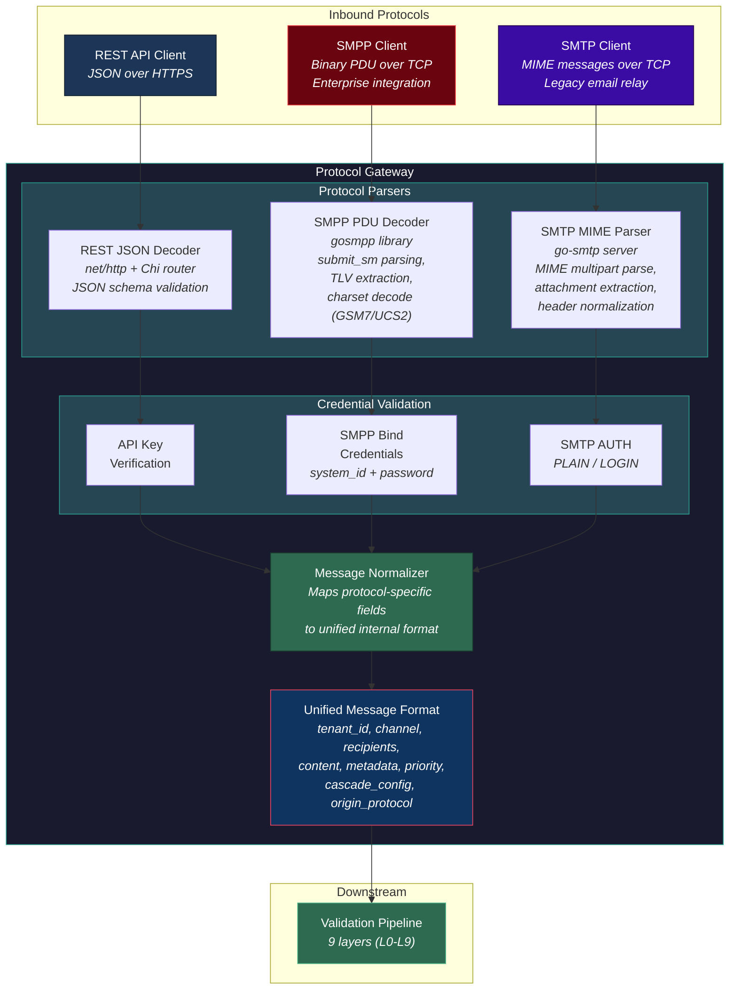

---

## 12. Smart Routing Engine

The Smart Router sits between the Cascade Engine and the delivery infrastructure. When the Cascade Engine determines which channel to use, the Smart Router decides the optimal delivery path: direct carrier (cheapest), aggregator (medium cost), or retail provider API (highest cost, highest reliability). For SMS, it performs HLR/MNP lookups to identify the subscriber's home carrier. For email, it evaluates MTA pool health. For WhatsApp, it checks BSP availability.

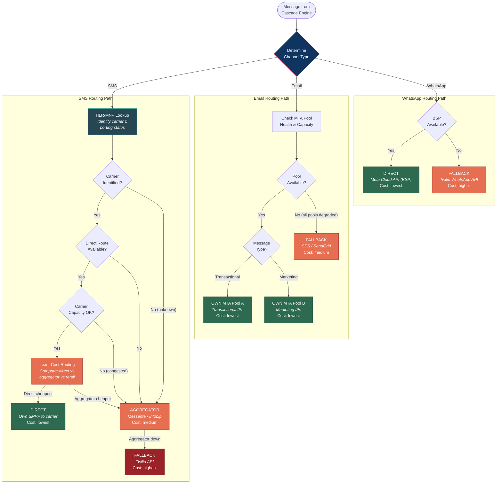

---

## 13. Carrier-Direct SMS Infrastructure

Detailed view of the SMPP infrastructure that enables direct carrier connections. The SMPP Connection Pool Manager maintains persistent transceiver binds to each carrier, manages sliding window flow control for throughput optimization, and handles delivery receipt (DLR) processing. When a carrier connection degrades, traffic automatically fails over to the aggregator path.

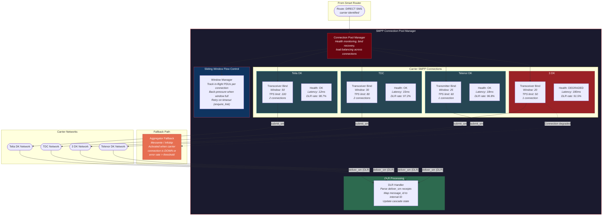

---

## 14. Email MTA Infrastructure

The MTA infrastructure separates transactional and marketing email traffic into isolated IP pools to protect sender reputation. Each pool manages its own IP warming schedules, DKIM signing keys (per-tenant), and SPF/DMARC alignment. ISP feedback loops feed back into the Reputation Engine. When pool capacity is exceeded or health degrades, traffic overflows to SES or SendGrid as elastic burst capacity.

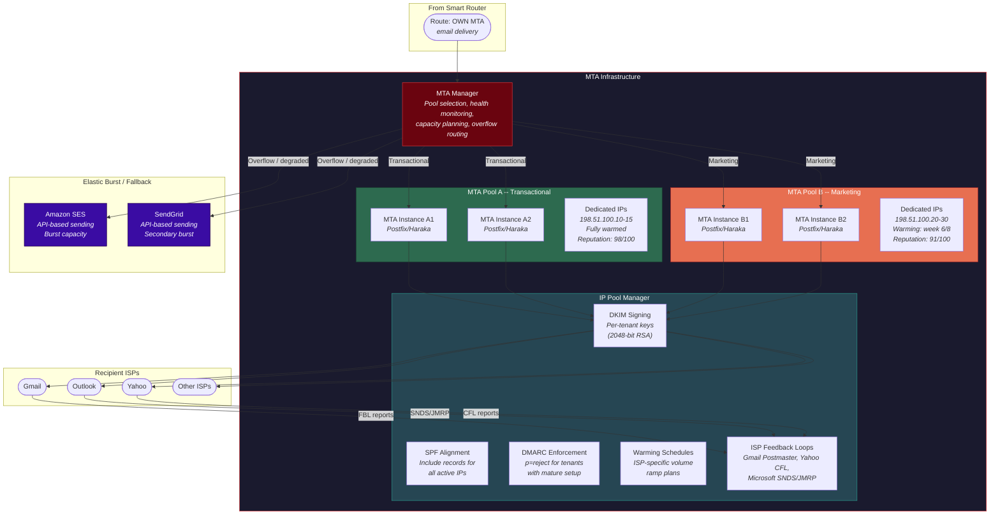

---

## 15. Inbound SMPP Enterprise Integration

End-to-end sequence showing an enterprise client connected via SMPP. The client maintains a persistent transceiver bind to the Hermes SMPP Server, sends messages as submit_sm PDUs, and receives delivery receipts as deliver_sm PDUs on the same bind. This enables high-throughput, low-latency integration without HTTP overhead.

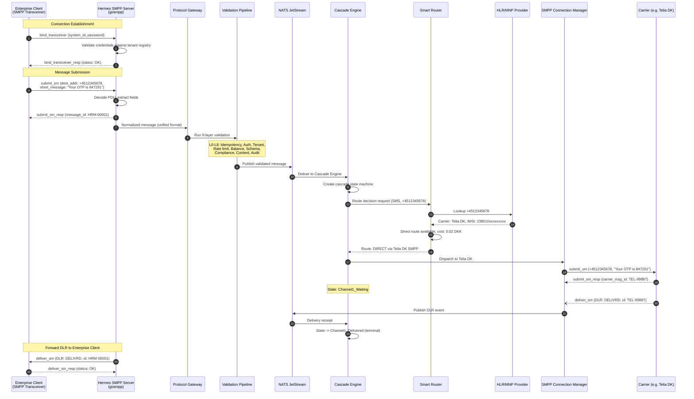

---

## 16. End-to-End Carrier-Direct Message Flow

Complete sequence showing a REST API message taking the carrier-direct path. A client sends an SMS to a Danish mobile number via the REST API. The message traverses the full validation pipeline, the Cascade Engine invokes the Smart Router which performs an HLR lookup, determines the cheapest direct route, and dispatches via SMPP to the carrier. The delivery receipt flows back to confirm delivery and triggers the client's webhook.

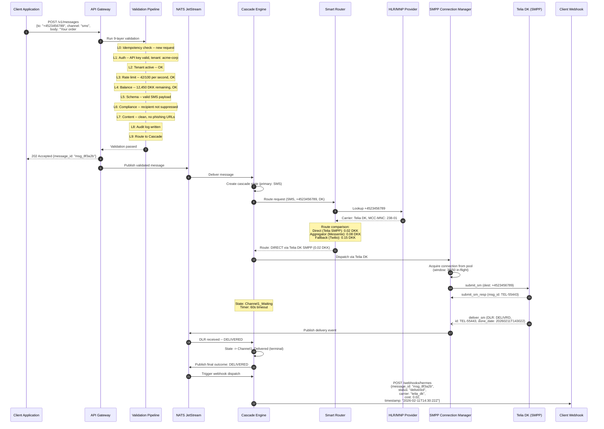

---

## 17. Route Selection Decision Matrix

Overview of how the Smart Router selects the optimal delivery path for each channel type. The decision follows a tiered preference: direct infrastructure first (lowest cost), then aggregator partners (medium cost), then retail provider APIs (highest cost, highest reliability guarantee). Each tier has specific availability checks before traffic is routed.

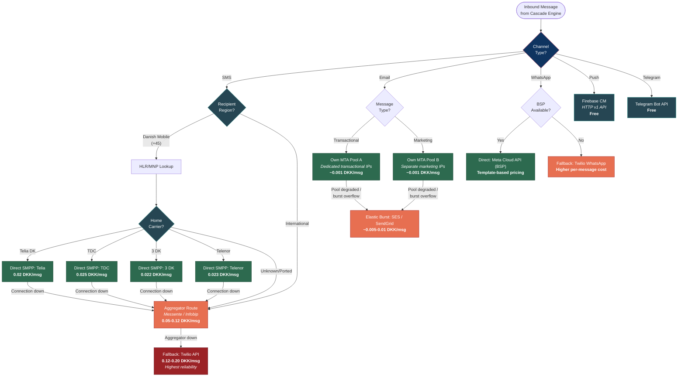

---

## Diagram Index

| # | Diagram | Type | Key Concepts |
|---|---------|------|-------------|
| 1 | System Overview | C4 Context | External actors, platform boundary, carrier-direct + provider paths |
| 2 | Main Cluster Architecture | Component (Flowchart) | Protocol Gateway, Smart Router, SMPP/MTA managers, NATS connectivity |
| 3 | Tenant Tier Model | Flowchart | Starter / Business / Enterprise isolation levels |
| 4 | Message Flow | Sequence | Full message lifecycle, validation through delivery |
| 5 | Cascade Engine States | State Diagram | Multi-channel fallback state machine |
| 6 | Tenant Onboarding | Sequence | Sign-up through provisioning to dashboard |
| 7 | Adapter Registration | Sequence | Ed25519 auth, heartbeat protocol, graceful shutdown |
| 8 | IP Reputation Engine | Flowchart | Scoring, warming, blacklist, routing decisions |
| 9 | Validation Pipeline | Flowchart | 9 layers with rejection paths |
| 10 | Deployment Architecture | Flowchart | Docker Compose (dev) and Kubernetes (prod) |
| 11 | Protocol Gateway Layer | Flowchart | REST/SMPP/SMTP inbound, protocol normalization, unified format |
| 12 | Smart Routing Engine | Flowchart | HLR/MNP lookup, least-cost routing, direct vs aggregator vs fallback |
| 13 | Carrier-Direct SMS Infrastructure | Flowchart | SMPP connection pools, window management, DLR handling, carrier binds |
| 14 | Email MTA Infrastructure | Flowchart | MTA pools, IP warming, DKIM/SPF/DMARC, ISP feedback loops |
| 15 | Inbound SMPP Enterprise Integration | Sequence | Enterprise SMPP bind, submit_sm/deliver_sm, DLR forwarding |
| 16 | End-to-End Carrier-Direct Flow | Sequence | REST to carrier-direct SMS, full validation, cost comparison, DLR |
| 17 | Route Selection Decision Matrix | Flowchart | Per-channel routing tiers, cost comparison, fallback chains |
